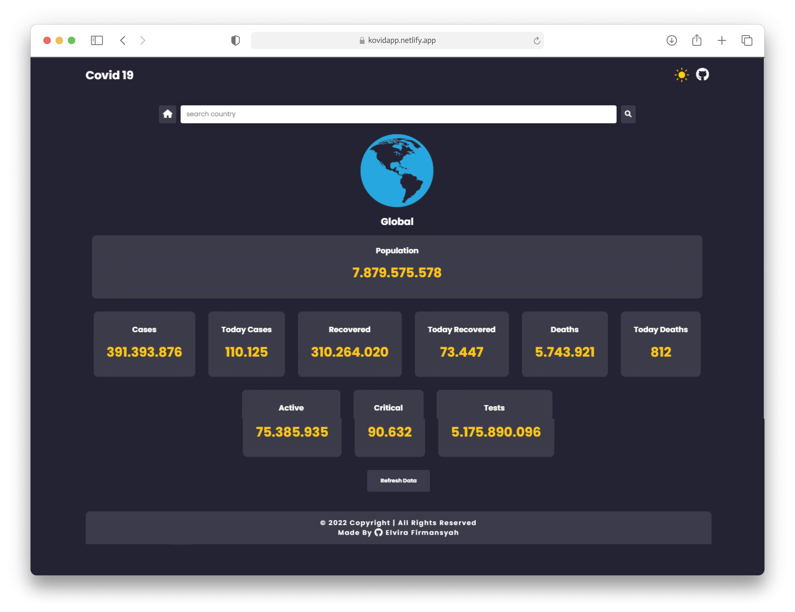

<div id="top"></div>

<!-- PROJECT LOGO -->
<div align="center">
  

  <h2 align="center">📈 Covid19 Tracker App</h2>

  <p align="center">
    An Awesome Covid Tracker 
    <br />
    <a href="https://github.com/elvirafimansyah/covid-app"><strong>Explore the docs »</strong></a>
    <br />
    <br />
    <a href="https://kovidapp.netlify.app/">View Demo</a>
    
  </p>
  
</div>

<!-- TABLE OF CONTENTS -->
<details>
  <summary>Table of Contents</summary>
  <ol>
    <li>
      <a href="#about-the-project">About The Project</a>
      <ul>
        <li><a href="#built-with">Built With</a></li>
      </ul>
    </li>
    <li>
      <a href="#getting-started">Getting Started</a>
      <ul>
        <li><a href="#installation">Installation</a></li>
      </ul>
    </li>
    <li><a href="#contact">Contact</a></li>
    <li><a href="#acknowledgments">Acknowledgments</a></li>
  </ol>
</details>


<!-- ABOUT THE PROJECT -->
## About The Project



A simple javascript app to track COVID-19 cases. The data we provide is collected from [World Health Organization (WHO)](https://www.who.int/) which provides regional case estimates faster than the national level reporting organizations.

A live trakcer for COVID19 stats across the Globe. It uses APIs so the data is live.

<p align="right">(<a href="#top">back to top</a>)</p>


<br/>

### Built With

This section should list any major frameworks/libraries used to bootstrap your project. Leave any add-ons/plugins for the acknowledgements section. Here are a few examples.

* __Vanilla JS__
* __HTML__
* __CSS__
* __[Font Awesome](https://fontawesome.com/)__
* __[API](https://disease.sh/)__

<p align="right">(<a href="#top">back to top</a>)</p>


<!-- GETTING STARTED -->
## Getting Started

This is an example of how you may give instructions on setting up your project locally.
To get a local copy up and running follow these simple example steps.


### Installation

_Below is an example of how you can instruct your audience on installing and setting up your app. This template doesn't rely on any external dependencies or services._

1. Clone the repo
   ```sh
   git clone https://github.com/elvirafimansyah/covid-app.git
   ```
2. Install NPM packages
   ```sh
   npm install
   ```


<p align="right">(<a href="#top">back to top</a>)</p>


<!-- CONTACT -->
## Contact

Instagram:  [@elvinaelvira.s](https://www.instagram.com/elvinaelvira.s/) 

Email: [freddyfirmansyah25@gmail.com](https://mail.google.com/mail/u/0/?fs=1&tf=cm&to=freddyfirmansyah25@gmail.com)

Personal Site: [portfolio](https://elvira.elvinaf.xyz/)

<p align="right">(<a href="#top">back to top</a>)</p>

<!-- ACKNOWLEDGMENTS -->
## Acknowledgments

Use this space to list resources you find helpful and would like to give credit to. I've included a few of my favorites to kick things off!

* [GitHub Emoji Cheat Sheet](https://www.webpagefx.com/tools/emoji-cheat-sheet)
* [GitHub Pages](https://pages.github.com)
* [Font Awesome](https://fontawesome.com)

<p align="right">(<a href="#top">back to top</a>)</p>